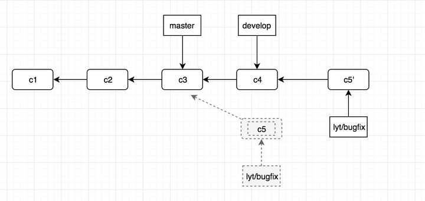
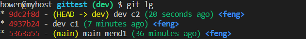
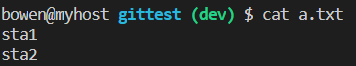

合并多次commit

rebase的作用简要概括为：可以对某一段线性提交历史进行编辑、删除、复制、粘贴；因此，合理使用rebase命令可以使我们的提交历史干净、简洁！

但是需要注意的是：不要通过rebase对任何已经提交到公共仓库中的commit进行修改（你自己一个人玩的分支除外）


当我们在本地仓库中提交了多次，在我们把本地提交push到公共仓库中之前，为了让提交记录更简洁明了，我们希望把如下分支B、C、D三个提交记录合并为一个完整的提交，然后再push到公共仓库。


```shell
git rebase -i HEAD~3 

#以下为解释
git rebase -i  [startpoint]  [endpoint]

其中-i的意思是--interactive，即弹出交互式的界面让用户编辑完成合并操作，
[startpoint] [endpoint]则指定了一个编辑区间，如果不指定[endpoint]，
则该区间的终点默认是当前分支HEAD所指向的commit(注：该区间指定的是一个前开后闭的区间)

```


然后我们会看到如下界面:


git 为我们提供了以下几个命令

- pick:   保留该commit（缩写:p）
- reword: 保留该commit，但我需要修改该commit的注释（缩写:r）
- edit:   保留该commit, 但我要停下来修改该提交(不仅仅修改注释)（缩写:e）
- squash: 将该commit和前一个commit合并（缩写:s）
- fixup:  将该commit和前一个commit合并，但我不要保留该提交的注释信息（缩写:f）
- drop:   我要丢弃该commit（缩写:d）


根据我们的需求，我们将commit内容编辑如下:


保存退出后会进入“commit message” 修改界面，修改完成后，保存退出即可完成commit的合并了


修改已提交的commit注释

如果你只想修改最后一次注释（就是最新的一次提交），那好办：

```shell
git commit --amend

```


修改之前的某次注释：使用rebase


## 分支合并

git pull命令默认是使用merge方式将远端别人的修改拉到本地；如果带上上参数git pull -r，就会使用rebase的方式将远端修改拉到本地。

rebase 的原理就是会找到当前分支（lyt/bugfix）和变基的基底分支(develop)这两个分支的共同提交祖先C3，然后对比当前分支相对于祖先之后的历次提交，将这些提交存储为临时文件，最后找到基底分支的目标提交C4，将这些暂存的临时文件依次应用。

之后我们看到的提交历史就如下：




准备工作

dev，sta 均在main的基础上分别有两次提交，

其中dev中a.txt文件内容为

```shell
dev1
dev2

```


sta中a.txt文件内容为

```shell
sta1
sta2

```





开始合并


会提示有冲突，git status 命令会看到具体冲突的文件


第一次解决冲突如上图，发现此时基底已经变为dev c2 这次commit了，我们此次选择 apply current change

add 之后 continue 发现陷入死循环了

我们 git rebase --skip 跳过这次commit，发现冲突变成了下面这个，我们选择 accept incoming change


解决冲突完add 之后 continue  sta分支完成


切到dev分支进行merge


可以看到dev分支的 a.txt跟着变了




结论：rebase之后前面的commit都可以跳过，只留下最后一个commit进行合并即可，更好的解决办法是rebase之前先把commit记录合并为一条


对于变基操作，最关键的一点就是如果自己的分支被别人使用了成为了一个公共的分支，此时千万不要再进行变基操作。如果使用 rebase 操作了那些已经公开的提交对象，并且已经有人基于这些提交对象开展了后续开发工作的话，就会使得提交历史变得十分混乱。

借用一句话：只对尚未推送或分享给别人的本地修改执行变基操作清理历史，从不对已推送至别处的提交执行变基操作。进行变基的分支一定要是自己本地新建的分支，绝不能是master分支

