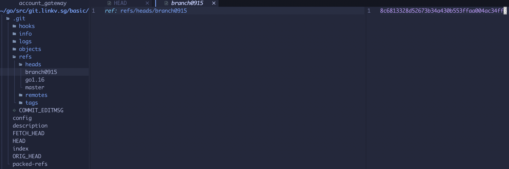

根目录有一个HEAD 文件，内容是指向heads文件夹下某个文件的引用

`refs/heads/` 文件夹存储的内容是当前项目所有分支的头指针，每个分支的头指针都指向该分支的最新提交。

HEAD 也可以直接指向提交，此时会进入一种特殊的状态 `detached HEAD`

当 HEAD 指针直接指向提交时，就会导致 detached HEAD 状态。在这个状态下，如果创建了新提交，新提交不属于任何分支。相对应的，现存的所有分支也不会受 detached HEAD 状态提交的影响。

在某些特殊的场景下你可能会需要它。

例如:
排查问题的时候，checkout 到怀疑的 commit 点上去做些测试，detached HEAD会保护你的现有分支不受影响，测试完了不想保存直接 checkout 到其他地方，可以放弃修改。想保存修改，可以创建一个 git checkout -b <new-branch-name> 新分支保存。

## 各种head
HEAD
指向当前正在操作的 commit。

ORIG_HEAD
当使用一些在 Git 看来比较危险的操作去移动 HEAD 指针的时候，ORIG_HEAD 就会被创建出来，记录危险操作之前的 HEAD，方便 HEAD 的恢复，有点像修改前的备份。

FETCH_HEAD
记录从远程仓库拉取的记录。

MERGE_HEAD
当运行 git merge 时，MERGE_HEAD 记录你正在合并到你的分支中的提交。MERGE_HEAD在合并的时候会出现，合并结束，就删除了这个文件。

CHERRY_PICK_HEAD
记录您在运行运行 git cherry-pick时要合并的提交。同上，这个文件只在 cherry-pick 期间存在。

