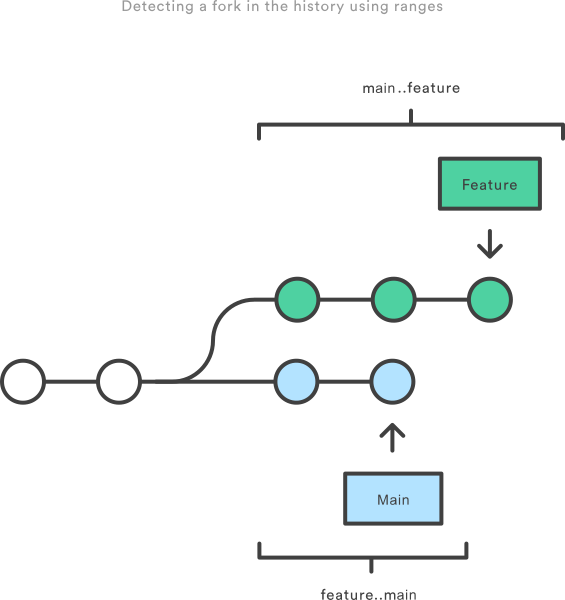

## Git log
- --decorate  display all of the references (e.g., branches, tags, etc) that point to each commit.
- --stat option displays the number of insertions and deletions to each file altered by each commit
- -p option to git log. This outputs the entire patch representing that commit
- --pretty=format:"" option. This lets you display each commit however you want using printf-style placeholders.

###  Filtering
- -3                                     By Amount
- --after="2014-7-1" --before="2014-7-4" By Date
- --author="John"                        By Author
- --grep="JRA-224:"                      By Message
- -i  ignore case differences while pattern matching
- -- foo.py bar.py                       By File
- -S"Hello, World!"                      By Content
- -G""  using a regular expression instead of a string
- --no-merges
- --merges


### By Range

You can pass a range of commits to `git log` to show only the commits contained in that range. The range is specified in the following format, where `` and `` are commit references:

```
git log ..
```

This command is particularly useful when you use branch references as the parameters. It’s a simple way to show the differences between 2 branches. Consider the following command:

```
 git log main..feature
```

The `main..feature` range contains all of the commits that are in the `feature` branch, but aren’t in the `main` branch. In other words, this is how far `feature` has progressed since it forked off of `main`. You can visualize this as follows:



Note that if you switch the order of the range (`feature..main`), you will get all of the commits in `main`, but not in `feature`. If `git log` outputs commits for both versions, this tells you that your history has diverged.


## reflog
reflog,Reference log，引用日志。当本地仓库中的引用发生移动时，reflog 都会记录下这个移动的行为
引用指的就是 HEAD 指针；引用的移动就是 HEAD 指针的移动；通过记录操作的命令，操作的次序，操作的内容，操作后的提交信息，来记录这整个操作引起的指针移动行为。jkkkk

4699cf6 HEAD@{2}: commit: 增加按来源过滤主播

- 4699cf6 是 commit 的 SHA1 值,需要特别注意，它是移动后的 commit。
- HEAD@{2} 是标识这是 HEAD 指针2个移动前的指向内容（从当前往回数第3个操作）
- commit 是表示造成这个移动的原因，是进行了 commit 操作。
- 增加按来源过滤主播 表示操作的内容，commit 操作对应的就是 commit message。


引用指的不仅仅是 HEAD 指针，还有分支指针。

```
git reflog <ref>
```
<ref> 默认的是 HEAD 指针，如果我们想查看其他的引用，换成对应的内容就可以。

```
 //查看 master 分支指针的移动记录
 git reflog master

 //查看 feature/test 分支指针的移动记录
 git reflog feature/test
```

reflog 的治愈力
这是一个比较治愈的命令，为什么呢？因为在误操作丢失数据之后，大多能通过它找回来。
例如：
误删了未合并的分支
reset --hard 的时候一不小心HEAD^写成 HEAD^^^，历史倒退太多了
等等，各种失误 & 只是任性的只是想恢复了
这些涉及到指针移动的都可以，全部通过 reflog 找回来。

恢复的流程基本都一样：

- 第一步：git reflog找回错误操作前的 commit。
- 第二步：视你自己的需要，对这个提交做点什么。

https://blog.csdn.net/qq_32452623/article/details/79534832
