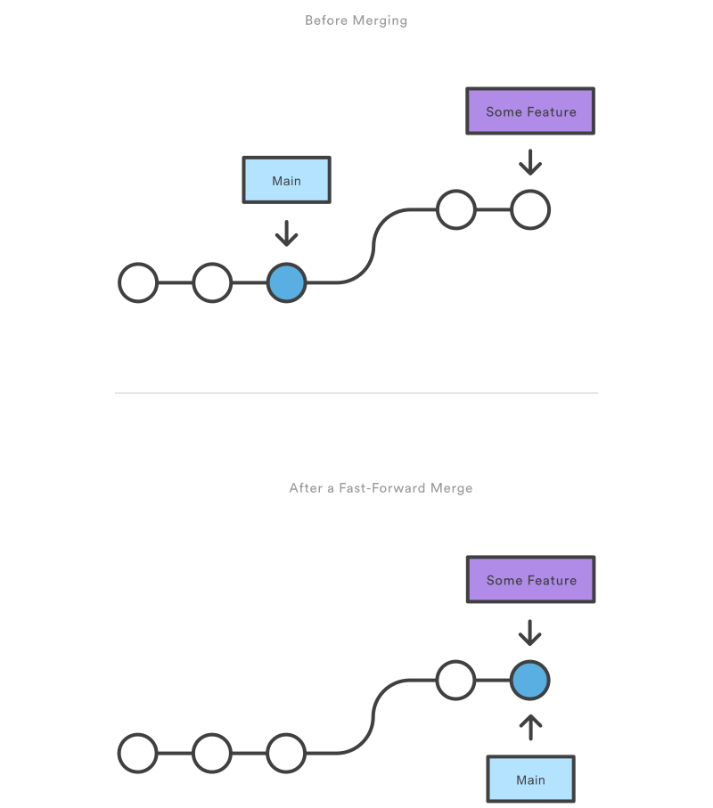

## Fast Forward Merge

A fast-forward merge can occur when there is a linear path from the current branch tip to the target branch. Instead of “actually” merging the branches, all Git has to do to integrate the histories is move (i.e., “fast forward”) the current branch tip up to the target branch tip. For example, a fast forward merge of some-feature into `main` would look something like the following:




However, a fast-forward merge is not possible if the branches have diverged. When there is not a linear path to the target branch, Git has no choice but to combine them via a 3-way merge. 3-way merges use a dedicated commit to tie together the two histories. The nomenclature comes from the fact that Git uses three commits to generate the merge commit: the two branch tips and their common ancestor.


While you can use either of these merge strategies, many developers like to use fast-forward merges (facilitated through rebasing](https://www.atlassian.com/git/tutorials/rewriting-history/git-rebase)) for small features or bug fixes, while reserving 3-way merges for the integration of longer-running features. In the latter case, the resulting merge commit serves as a symbolic joining of the two branches.

 The code below creates a new branch, adds two commits to it, then integrates it into the main line with a fast-forward merge.

### How conflicts are presented
When Git encounters a conflict during a merge, It will edit the content of the affected files with visual indicators that mark both sides of the conflicted content. These visual markers are: <<<<<<<, =======, and >>>>>>>. Its helpful to search a project for these indicators during a merge to find where conflicts need to be resolved.

```
here is some content not affected by the conflict
<<<<<<< main
this is conflicted text from main
=======
this is conflicted text from feature branch
>>>>>>> feature branch;
```
Generally the content before the ======= marker is the receiving branch and the part after is the merging branch.

Once you've identified conflicting sections, you can go in and fix up the merge to your liking. When you're ready to finish the merge, all you have to do is run git add on the conflicted file(s) to tell Git they're resolved. Then, you run a normal git commit to generate the merge commit.

Note that merge conflicts will only occur in the event of a 3-way merge. It’s not possible to have conflicting changes in a fast-forward merge. 

### Git commands that can help resolve merge conflicts
#### General tools
git status
The status command is in frequent use when a working with Git and during a merge it will help identify conflicted files.

git log --merge
Passing the --merge argument to the git log command will produce a log with a list of commits that conflict between the merging branches.

git diff
diff helps find differences between states of a repository/files. This is useful in predicting and preventing merge conflicts.

#### Tools for when git fails to start a merge
git checkout
checkout can be used for undoing changes to files, or for changing branches

git reset --mixed
reset can be used to undo changes to the working directory and staging area.

#### Tools for when git conflicts arise during amerge
git merge --abort
Executing git merge with the --abort option will exit from the merge process and return the branch to the state before the merge began.

git reset
Git reset can be used during a merge conflict to reset conflicted files to a know good state

 
