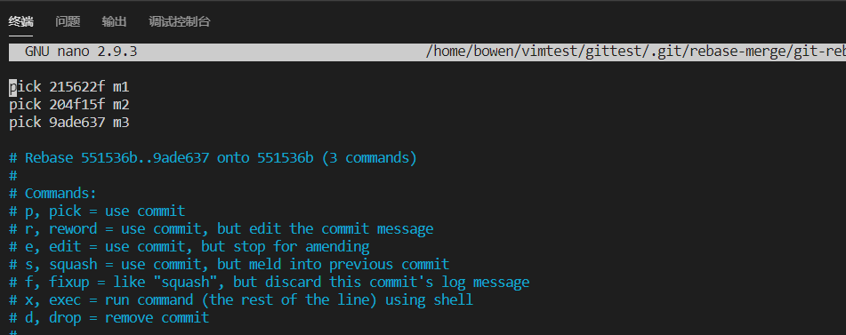
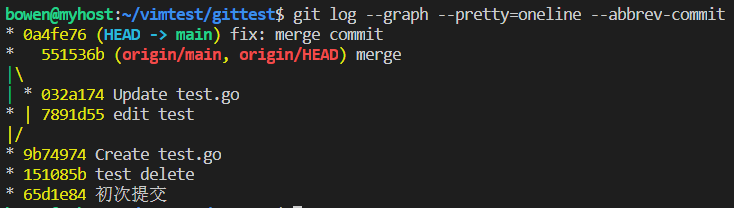

## git commit --amend
The git commit --amend command is a convenient way to modify the most recent commit. It lets you combine
staged changes with the previous commit instead of creating an entirely new commit. It can also be used 
to simply edit the previous commit message without changing its snapshot. But, amending does not just alter
the most recent commit, it replaces it entirely, meaning the amended commit will be a new entity with its own ref.
```sh
# Change most recent Git commit message,Running this command when there is nothing staged lets you edit the previous commit’s message without altering its snapshot
git commit --amend
# Adding the -m option allows you to pass in a new message from the command line without being prompted to open an editor
git commit --amend -m "an updated commit message"

# Changing committed files
git commit --amend
# The --no-edit flag will allow you to make the amendment to your commit without changing its commit message
git commit --amend --no-edit
```

合并多次commit

rebase的作用简要概括为：可以对某一段线性提交历史进行编辑、删除、复制、粘贴；因此，合理使用rebase命令可以使我们的提交历史干净、简洁！

但是需要注意的是：不要通过rebase对任何已经提交到公共仓库中的commit进行修改（你自己一个人玩的分支除外）


当我们在本地仓库中提交了多次，在我们把本地提交push到公共仓库中之前，为了让提交记录更简洁明了，我们希望把如下分支B、C、D三个提交记录合并为一个完整的提交，然后再push到公共仓库。


```sh
git rebase -i HEAD~3 

# 以下为解释
git rebase -i  [startpoint]  [endpoint]

其中-i的意思是--interactive，即弹出交互式的界面让用户编辑完成合并操作，
[startpoint] [endpoint]则指定了一个编辑区间，如果不指定[endpoint]，
则该区间的终点默认是当前分支HEAD所指向的commit(注：该区间指定的是一个前开后闭的区间)

```


然后我们会看到如下界面:



git 为我们提供了以下几个命令

- pick:   保留该commit（缩写:p）
- reword: 保留该commit，但我需要修改该commit的注释（缩写:r）
- edit:   保留该commit, 但我要停下来修改该提交(不仅仅修改注释)（缩写:e）
- squash: 将该commit和前一个commit合并（缩写:s）
- fixup:  将该commit和前一个commit合并，但我不要保留该提交的注释信息（缩写:f）
- drop:   我要丢弃该commit（缩写:d）


根据我们的需求，我们将commit内容编辑如下:


保存退出后会进入“commit message” 修改界面，修改完成后，保存退出即可完成commit的合并了



