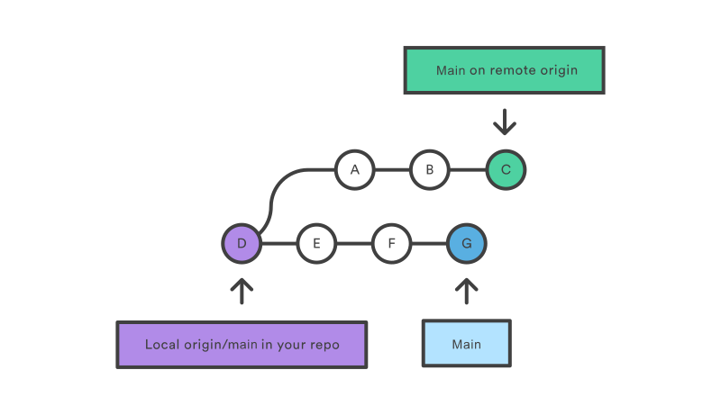
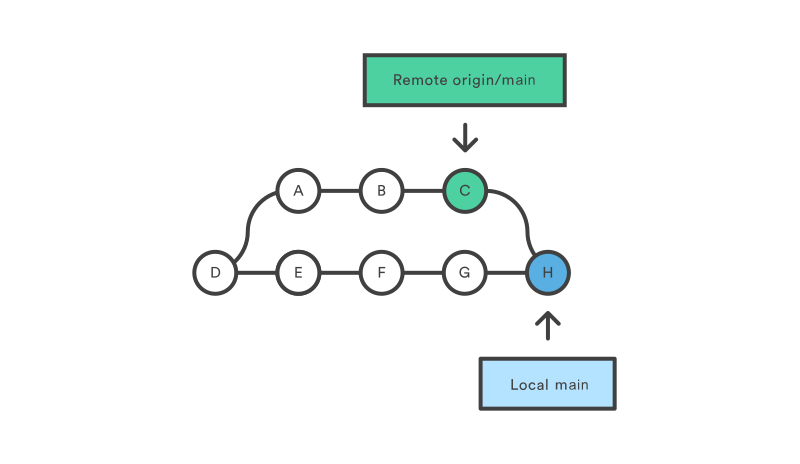
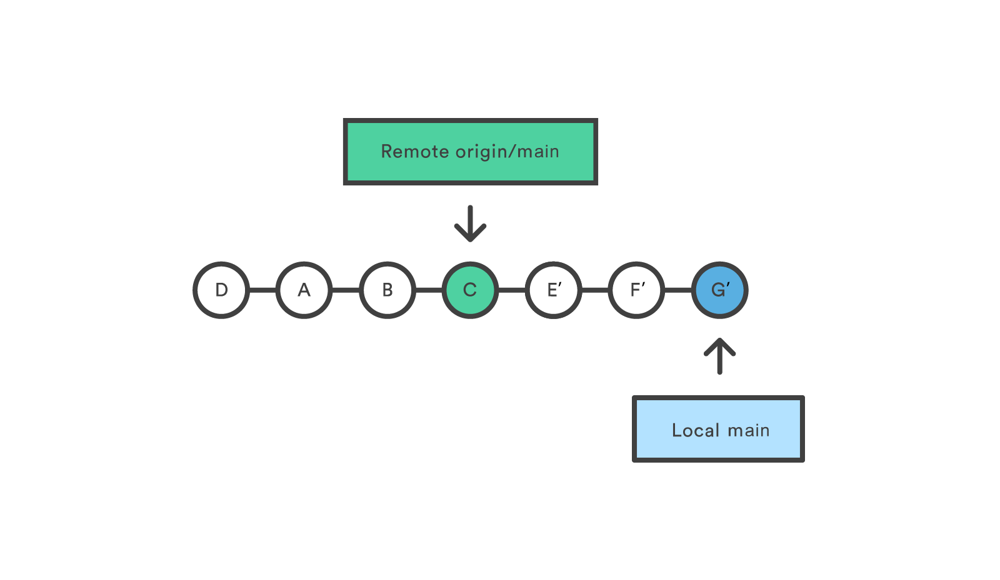

## Git remote
The git remote command lets you create, view, and delete connections to other repositories. Instead of providing real-time access to another repository, they serve as convenient names that can be used to reference a not-so-convenient URL.

For example, the following diagram shows two remote connections from your repo into the central repo and another developer’s repo. Instead of referencing them by their full URLs, you can pass the origin and john shortcuts to other Git commands.

### Git remote usage overview
The git remote command is essentially an interface for managing a list of remote entries that are stored in the repository's ./.git/config file.

### Viewing git remote configurations
```sh
# List the remote connections you have to other repositories.
git remote

# Same as the above command, but include the URL of each connection.
git remote -v

git remote show origin 
```


### Creating and modifying git remote configurations

```sh
# Create a new connection to a remote repository. After adding a remote, you’ll be able to use ＜name＞ as a convenient shortcut for ＜url＞ in other Git commands.
git remote add <name> <url>

# Remove the connection to the remote repository called ＜name＞.
git remote rm <name>

# Rename a remote connection from ＜old-name＞ to ＜new-name＞.
git remote rename <old-name> <new-name>
```

### The origin Remote
When you clone a repository with git clone, it automatically creates a remote connection called ***origin*** pointing back to the cloned repository


### Repository URLs
Git supports many ways to reference a remote repository. Two of the easiest ways to access a remote repo are via the HTTP and the SSH protocols. HTTP is an easy way to allow anonymous, read-only access to a repository. For example:
http://host/path/to/repo.git

But, it’s generally not possible to push commits to an HTTP address (you wouldn’t want to allow anonymous pushes anyways). For read-write access, you should use SSH instead:
ssh://user@host/path/to/repo.git
You’ll need a valid SSH account on the host machine


## git fetch
The git fetch command downloads commits, files, and refs from a remote repository into your local repo. Fetching is what you do when you want to see what everybody else has been working on. Git isolates fetched content from existing local content; it has absolutely no effect on your local development work. Fetched content has to be explicitly checked out using the git checkout command. This makes fetching a safe way to review commits before integrating them with your local repository.

When downloading content from a remote repo, git pull and git fetch commands are available to accomplish the task. You can consider git fetch the 'safe' version of the two commands. It will download the remote content but not update your local repo's working state, leaving your current work intact. git pull is the more aggressive alternative; it will download the remote content for the active local branch and immediately execute git merge to create a merge commit for the new remote content. If you have pending changes in progress this will cause conflicts and kick-off the merge conflict resolution flow.


### Git fetch commands and options
```sh
git fetch <remote>
# Fetch all of the branches from the repository. This also downloads all of the required commits and files from the other repository.

git fetch <remote> <branch>
# Same as the above command, but only fetch the specified branch.

git fetch --all
# A power move which fetches all registered remotes and their branches:
```

### Git fetch examples
#### git fetch a remote branch
The following example will demonstrate how to fetch a remote branch and update your local working state to the remote contents.

```
# fetching coworkers/feature_branch
git fetch coworkers_repo coworkers/feature_branch
```
We now locally have the contents of coworkers/feature_branch we will need the integrate this into our local working copy. We begin this process by using the git checkout command to checkout the newly downloaded remote branch.

```
$ git checkout coworkers/feature_branch
Note: checking out coworkers/feature_branch'.

You are in 'detached HEAD' state. You can look around, make experimental
changes and commit them, and you can discard any commits you make in this
state without impacting any branches by performing another checkout.

If you want to create a new branch to retain commits you create, you may
do so (now or later) by using -b with the checkout command again. Example:

git checkout -b <new-branch-name>
```
The output from this checkout operation indicates that we are in a detached HEAD state. This is expected and means that our HEAD ref is pointing to a ref that is not in sequence with our local history. Being that HEAD is pointed at the coworkers/feature_branch ref, we can create a new local branch from that ref. The 'detached HEAD' output shows us how to do this using the git checkout command:

```
git checkout -b local_feature_branch
```
Here we have created a new local branch named local_feature_branch. This puts updates HEAD to point at the latest remote content and we can continue development on it from this point.

### Synchronize origin with git fetch
The following example walks through the typical workflow for synchronizing your local repository with the central repository's main branch.

```
git fetch origin
```
This will display the branches that were downloaded:


To see what commits have been added to the upstream main, you can run a git log using origin/main as a filter:  
```
git log --oneline main..origin/main
```
或者用git status命令也能查看

To approve the changes and mere them into your local main branch use the following commands:
```
git checkout main
git merge origin/main
```
The origin/main and main branches now point to the same commit, and you are synchronized with the upstream developments.


## git pull
```sh
# Fetch the specified remote’s copy of the current branch and immediately merge it into the local copy.
# This is the same as git fetch ＜remote＞ followed by git merge origin/＜current-branch＞.
git pull <remote>

# Similar to the default invocation, fetches the remote content but does not create a new merge commit.
git pull --no-commit <remote>

# Same as the previous pull Instead of using git merge to integrate the remote branch with the local one, use git rebase.
git pull --rebase <remote>

# Gives verbose output during a pull which displays the content being downloaded and the merge details.
git pull --verbose
```
### Default Behavior
```
git pull
```
Executing the default invocation of git pull will is equivalent to git fetch origin HEAD and git merge HEAD where HEAD is ref pointing to the current branch.


### How it works

The `git pull` command first runs `git fetch` which downloads content from the specified remote repository. Then a `git merge` is executed to merge the remote content refs and heads into a new local merge commit. To better demonstrate the pull and merging process let us consider the following example. Assume we have a repository with a main branch and a remote origin.



In this scenario, `git pull` will download all the changes from the point where the local and main diverged. `git pull` will fetch the diverged remote commits which are A-B-C. The pull process will then create a new local merge commit containing the content of the new diverged remote commits.



In the above diagram, we can see the new commit H. This commit is a new merge commit that contains the contents of remote A-B-C commits and has a combined log message. This example is one of a few `git pull` merging strategies. A `--rebase` option can be passed to `git pull` to use a rebase merging strategy instead of a merge commit. The next example will demonstrate how a rebase pull works. Assume that we are at a starting point of our first diagram, and we have executed `git pull --rebase`.



In this diagram, we can now see that a rebase pull does not create the new H commit. Instead, the rebase has copied the remote commits A--B--C and rewritten the local commits E--F--G to appear after them them in the local origin/main commit history.


## git push 命用于从将本地的分支版本上传到远程并合并。
```sh
# 命令格式如下：
git push <远程主机名> <本地分支名>:<远程分支名>
# 如果本地分支名与远程分支名相同，则可以省略冒号：
git push <远程主机名> <本地分支名>

# To prevent you from overwriting commits, Git won’t let you push when it results in a non-fast-forward merge in the destination repository
git push <remote> --force

# The --tags flag sends all of your local tags to the remote repository
git push <remote> --tags
```

