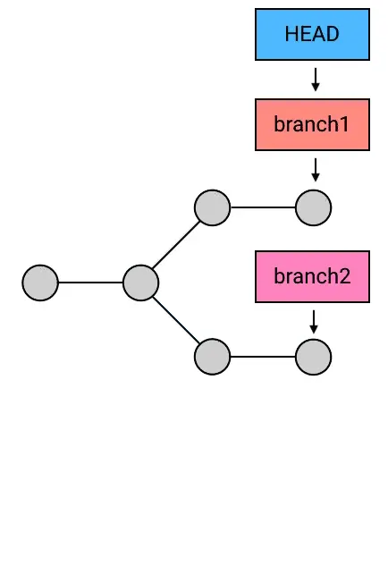

# Git Reset

## Main Options

The default invocation of `git reset` has implicit arguments of `--mixed` and `HEAD`. This means executing `git reset` is equivalent to executing `git reset --mixed HEAD`.


- --hard Any previously pending changes to the Staging Index and the Working Directory gets reset to match the state of the Commit Tree
-   --soft 工作目录的内容不会改变，目标commit之后的所有commit所造成的改变会被放进暂存区，此时对于同一个文件可能既在缓冲区等待被提交，又在等待被放入缓冲区的工作目录变动中
-  --mixed 工作目录的修改、暂存区的内容以及由 reset 所导致的新的文件差异，都会被放进工作目录。简而言之，就是「把所有差异都混合（mixed）放在工作目录中

总结：reset操作永远不会触发冲突。soft和mixed执行完之后，单看工程文件好像是没有任何变动，但是执行git status之后，就会发现目标commit之后的commit都丢失了，同时暂存区和Changes not staged for commit区都发生了很大变动；soft和mixed可以用来合并commit

### reset 的本质：移动 HEAD 以及它所指向的 branch

实质上，**reset** 这个指令虽然可以用来撤销 **commit** ，但它的实质行为并不是撤销，而是移动 **HEAD** ，并且「捎带」上 **HEAD** 所指向的 **branch**（如果有的话）。也就是说，**reset** 这个指令的行为其实和它的字面意思 "**reset**"（重置）十分相符：它是用来重置 **HEAD** 以及它所指向的 **branch** 的位置的。

而 **reset --hard HEAD^** 之所以起到了撤销 **commit** 的效果，是因为它把 **HEAD** 和它所指向的 branch 一起移动到了当前 **commit** 的父 **commit** 上，从而起到了「撤销」的效果：


git reset

Git 的历史只能往回看，不能向未来看，所以把 **HEAD** 和 **branch** 往回移动，就能起到撤回 **commit** 的效果。

所以同理，**reset --hard** 不仅可以撤销提交，还可以用来把 **HEAD** 和 **branch** 移动到其他的任何地方。


```shell
git reset --hard branch2
```




## Example
```sh
# unstages a file
git reset ＜file＞
# unstages all files
git reset
# 消除all uncommitted changes
git reset --hard
```

# Git Revert

撤销掉之前的某次commit。A revert operation will take the specified commit, inverse the changes from that commit, and create a new "revert commit"。可能会触发冲突，需要解决冲突。

.svg)

