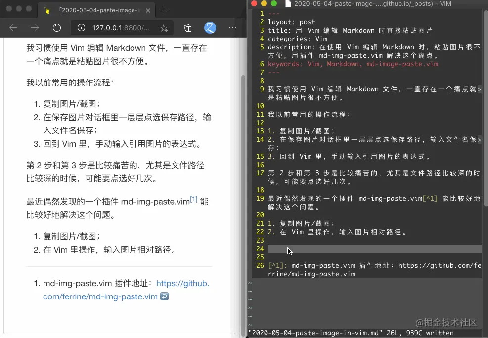

## 移动
k 0	移光标至行首
- ^	移光标至本行首个非空格的字节
- G	移光标至整个文本最后一行首个非空格字节
- %	移光标至匹配括号的另一端
- $	移动到当前行的末尾。
- gg  跳转到文件头部
- 数字+gg 跳转到指定行
- e 移光标至词末
- } 向后跳一个段落
- f (find) 和 t (till) 的功能都是在行内向右做单字符查找，并移动光标，只不过 f 是把光标挪到字符上， t 则是把光标挪到字符的左边 (till 的意思)。
- Ctrl + d 是向下 (down) 滚动文本，而 Ctrl + u 是向上 (up) 滚动文本。
- 移动光标的方法有 h j k l，w，b


* A    追加文本，会先将光标移到行尾
除了用 i 可进入输入模式之外，也可以用 a (append)。a 会在 i 的右侧一字节进入输入模式（所谓 append 的意思）。
* u    撤销更改
* Ctrl+r 恢复上一步被撤销的操作

滚动文本

取消搜索高亮 :noh
:help key-notation
模糊查找 helpgrep + [sth]
[数字] + 移动光标


在 vim 里，d 代表删除，c 则代表替换（并进入输入模式）
删除/替换 + motion
如果我们按下大写的 C, 从光标到行末都会被换掉

以 “行” 为单位的 operator 操作
[数字] + operator + perator (前后均为同一个 operator）


- >> - 将当前行向右缩进
<!-- - << - 将当前行向左缩进 -->

## 文本对象 (text-object)
文本对象 是 vim 描述文本的一种方式， 只能放在 operator 之后，由 i (inner) 或 a (a) 加 文本范围 （下面会有表格） 组成。其中， i 表示 “在文本范围之内”， a 表示 “整个文本范围”。
t    	tag （HTML 或 XML）标签
[ 或 ]	[…]
( 或 )	(…)
< 或 >	<…>
{ 或 }	{…}
“	    “…”
‘	    ‘…’
\`	    `…`
举个例子 di" (delete inner “) 会删除双引号之内的所有内容，而 da" (delete a “) 则会删除包含双引号在内的所有内容。

/charaters	查找指定的字符串，通过 n 命令来跳转到下一个,N 跳到上一个
:%s/cat/dog/g   用dog替换cat
模式为 global，即替换所有/g;模式为 confirm，即需要使用者确认是否替换文本: /c,  y 确认替换， n 代表不替换

## normal命令
当需要重复的操作比较简单时，可以配合使用 :{范围}normal . 命令，
而如果需要执行的重复操作比较复杂时，可以使用 :{范围}normal @q

## :g 全局命令
```vim
" 使用:g命令，可以针对所有匹配模式的行执行操作。其命令格式为：
:[range]g/{pattern}/[command]
" 命令:g!及其同义词:v，则可以针对所有不匹配模式的行执行操作。其命令格式为：
:[range]g!/{pattern}/[command]
" 如果没有指定[command]，则执行:print命令来显示行内容。
```

example
```vim
" 删除包含模式patternn的行：
:g/pattern/d
" 删除所有空行：
:g/^$/d
" 删除所有空行以及仅包含空格和Tab制表符的行：
:g/^[ tab]*$/d
" 将包含“microsoft antitrust”的行中的“judgment”替换为“ripoff”：
:g/microsoft antitrust/s/judgment/ripoff/
" 可以在命令中指定查找的范围。比如以下命令，将在包含“microsoft antitrust”的前两行及后两行中进行替换：
:g/microsoft antitrust/-2,/microsoft antitrust/+2s/judgment/ripoff/c
```

### 避免vim映射
normal命令中的可选参数 ! 用于指示vim在当前命令中不使用任何vim映射；如果没有显式使用 ! 选项，即便是执行一个非递归映射 (noremap) 命令，它的参数仍有可能被重新映射。

例如，假设已经设置了vim映射 :nnoremap G dd，则在vim普通模式按下 G 将执行命令 dd，即会删除一整行；此时，若在vim命令行模式下执行命令 :normal G 同样将删除当前行而不会跳转到当前文件的末行。

为了在即便 G 命令已经被设置了映射的条件下也能在vim normal命令中不改变 G 命令原始的含义，需要使用 :normal! G。通过 ! 选项显式指示Vim在当前命令中不使用任何vim映射。

所以，在任何时候写Vim脚本时，都建议总是使用 normal!，永远不要使用 normal 而给自己埋下不确定性的问题。


## 模式

### 插入模式
| 按键  | 作用                                    |
|-------|-----------------------------------------|
| i / a | 在光标位置前面/后面进入 insert 模式     |
| I / A | 在软行首/行尾位置进入 insert 模式       |
| o / O | 在下一行/上一行新起一行进入 insert 模式 |
| c     | 删除当前文本对象并进入 insert 模式      |
| C     | 删除到行尾进入 insert 模式              |
| s     | 删除当前字符进入 insert 模式            |
| r     | 用接下来的一个字符替换当前字符          |
| R     | 在光标位置进入 replace 模式             |
### 可视化模式
字符选择模式: 选中光标经过的所有字符，普通模式下按 v 进入
行选择模式：选中光标经过的所有行，普通模式下按 V 进入
块选择模式：选中一整个矩形框表示的所有文本，普通模式下按 <Ctrl> + v 进入

默认情况下，在Vim可视化模式下移动鼠标是控制右下角端点的位置，当需要调整左上角端点的位置时，可以使用o键在左上角和右下角之间进行切换
按大写的 I 进入行首插入模式
#
Nerdtree刷新 按r就一下子刷新了。

### 命令行模式
在命令模式下粘贴寄存器的内容方法是CTRL-R加寄存器的名字。复制之后的内容一般在寄存器"中。


#### Macro 宏
假设光标在首行第一个词 set 处，按下 qa 开始记录：cw (change word) 然后输入 test，回到 normal mode 后移光标至下一行行首，再按下 q，录制结束。
接下来我们想让 vim 替我们执行 10 遍，按下 10@a (10 Macro a) 就好了。

#### set 和 let
set设置的是选项， let设置的是变量
let g:godef_split=2    查看 :echo godef_split
查看set的值 :set expandtab?
verbose map <key>就可以查看以按键<key>开头的映射
verbose set  expandtab? 可以查看值以及是在哪个文件设置的
Abbreviations  :verbose ab teh

### clipboard
Vim 有12个粘贴板依次编号为：0、1、2、...、9、a、"、+，其中 + 号为系统粘贴板，” 为临时粘贴板。系统剪切板中的内容可在其他程序中使用。上面的复制指令都可以配合剪切板进行操作。"nyw 复制当前单词到 n 号剪切板（双引号开始） "np 粘贴 n 号剪切板内容到当前位置后 "+Y 复制当前行到系统剪切板"+nY 复制当前行往下 n 行到系统剪切板"+p 粘贴系统剪切板内容到当前位置后

### Operator-Pending Mappings
onoremap p i(

#### vim-table
Formatting existing content into a table
Table Mode wouldn't justify its name if it didn't allow formatting existing content into a table. And it does as promised. Like table creation typing on the fly, formatting existing content into a table is equally simple. You can visually select multiple lines and call :Tableize on it. Alternatively, the mapping <Leader>tt can be used (defined by the option g:table_mode_tableize_map). This converts CSV (Comma-separated Values) data into a table.

If however you wish to use a different delimiter, you can use the command :Tableize/{pattern} in a similar fashion as you tabulate (e.g. :Tableize/; uses ';' as the delimiter) or use the mapping <Leader>T (defined by the option g:table_mode_tableize_op_map) which takes input in the cmd-line and uses the {pattern} input as the delimiter.

:Tableize also accepts a range. Call it by giving lines manually like :line1,line2Tableize. However this may not be intuitive. You can use the mapping <Leader>T with a [count] to apply it to the next [count] lines in standard vim style.

## tagbar
### markdown
```python
pip3 install markdown2ctags

#搜索 markdown2ctags 的位置：
find / -iname "markdown2ctags.py" -type f 2>/dev/null

#设置 markdown2ctags
" Add support for markdown files in tagbar.
let g:tagbar_type_markdown = {
    \ 'ctagstype': 'markdown',
    \ 'ctagsbin' : '/path/to/markdown2ctags.py',  " 改为搜索到的 markdown2ctags.py 的位置
    \ 'ctagsargs' : '-f - --sort=yes --sro=»',
    \ 'kinds' : [
        \ 's:sections',
        \ 'i:images'
    \ ],
    \ 'sro' : '»',
    \ 'kind2scope' : {
        \ 's' : 'section',
    \ },
    \ 'sort': 0,
\ }
```

## map
let g:sessions_dir = '~/vim-sessions'

" Remaps for Sessions
exec 'nnoremap <Leader>ss :Obsession ' . g:session_dir . '/*.vim<C-D><BS><BS><BS><BS><BS>'
exec 'nnoremap <Leader>sr :so ' . g:session_dir. '/*.vim<C-D><BS><BS><BS><BS><BS>'

## useful function
```vim
""""""""""""""""""""""""""""""
"Chinese Punctuation
""""""""""""""""""""""""""""""
function! CheckChineseMark()
    "依次检查
    if search('。')
        let s:line=search('。')
        execute s:line . "s/。/\./g"
    endif

    if search('，')
        let s:line=search('，')
        execute s:line . "s/，/,/g"
    endif

    if search('；')
        let s:line=search('；')
        execute s:line . "s/；/,/g"

    endif

    if  search('？')
        let s:line=search('？')
        execute s:line . "s/？/?/g"
    endif

    if search('：')
        let s:line=search('：')
        execute s:line . "s/：/\:/g"
    endif

    if search('‘')
        let s:line=search('‘')
        execute s:line . "s/‘/\'/g"
    endif

    if search('’')
        let s:line=search('’')
        execute s:line . "s/’/\'/g"
    endif

    if search('”')
        let s:line=search('”')
        execute s:line . "s/”/\"/g"
    endif

    if search('“')
        let s:line=search('“')
        execute s:line . "s/“/\"/g"
    endif

    if search('《')
        let s:line=search('《')
        execute s:line . "s/《/\</g"
    endif

    if search('》')
        let s:linie=search('》')
        execute s:line . "s/》/\>/g"
    endif

    if search('——')
        let s:line=search('——')
        execute s:line . "s/——/-/g"
    endif

    if search('）')
        let s:line=search('）')
        execute s:line . "s/）/\)/g"
    endif

    if search('（')
        let s:line=search('（')
        execute s:line . "s/（/\(/g"
    endif

    if search('……')
        let s:line=search('……')
        execute s:line . "s/……/^/g"
    endif

    if search('￥')
        let s:line=search('￥')
        execute s:line . "s/￥/$/g"
    endif

    if search('！')
        let s:line=search('！')
        execute s:line . "s/！/!/g"
    endif

    if  search('·')
        let s:line=search('·')
        execute s:line . "s/·/`/g"
    endif

endfunction
unmap <C-S>
map! <C-S> <ESC>:call CheckChineseMark()<ESC>:w<ESC>a
```

```vim
" 删除空格行：
:g/^$/d
" 删除行首空格：
:%s/^\s*//g
" 删除行尾空格：
:%s/\s*$//g
```
在Linux机器上，使用s/^m//g替换时，^M要按住CTRL不放并按下v和m键完成输入

```vim
" 偶数行插入"
:g/^/if line('.') % 2==0 | execute "norm! I\" "  | endif
:g/^/if line('.') % 2!=0 | execute "norm! I\" "  | endif
```





